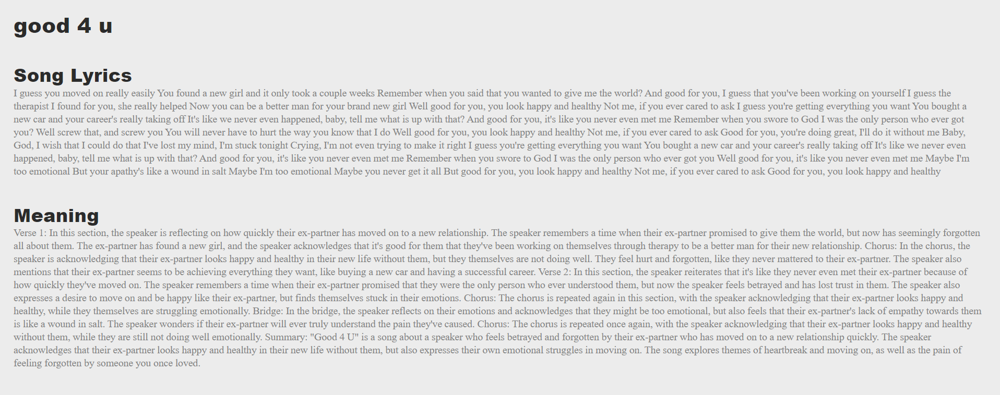
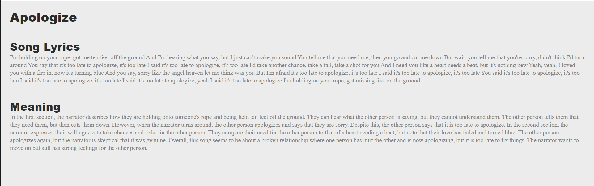
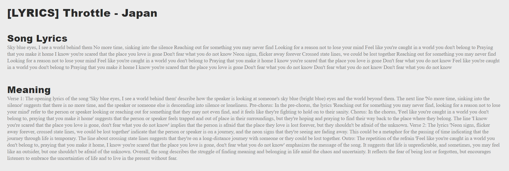

**OpenAI Hackathon Entry**

Entry by Embry-Riddle Aeronautical University Artificial Intelligence Club
Spring 2023

Participants: Tyler Carr, Connor Bramhall, Kai Sniadach, Jakob Haehre, Tyler Lofton, Jackson Salyards

How to setup:

1. Setup `OPENAI_API_KEY` in [.env](.env) file 
2. `pip3 install -r requirements.txt`
3. `python3 server.py`

How it works:

1. Visit a song on YouTube and copy+paste the URL
2. Enter the URL into the search box on the site's main page and hit enter
3. The song URL will be sent to OpenAI Whisper, which will transcribe the lyrics of the song into text
4. The song lyrics will be passed to OpenAI GPT-3.5-Turbo, which will infer the meaning of the song
5. The song lyrics and song meaning will be displayed on the page for the user

What it looks like:

